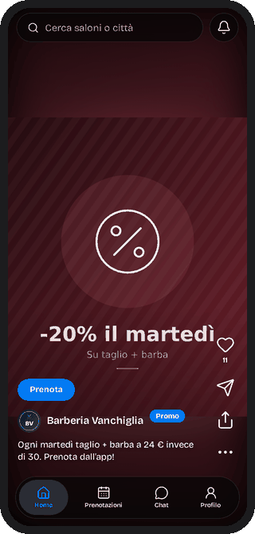
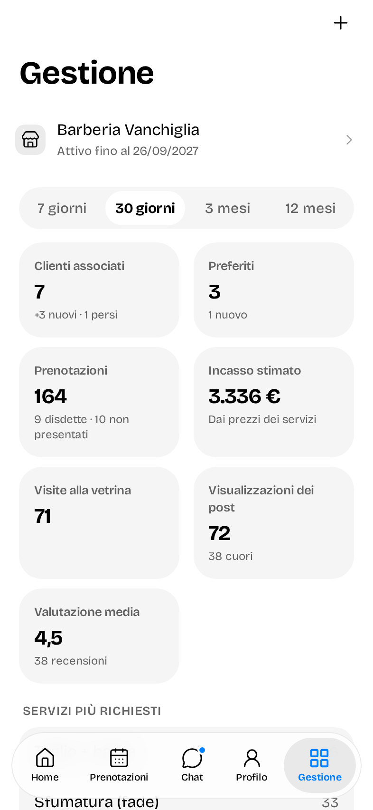
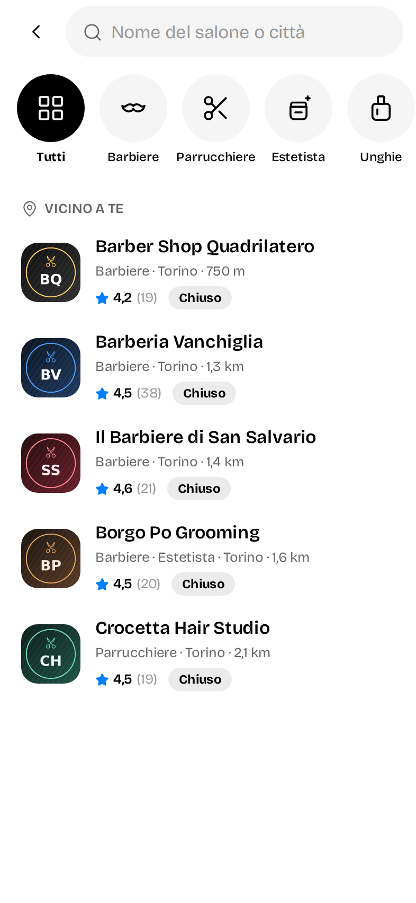
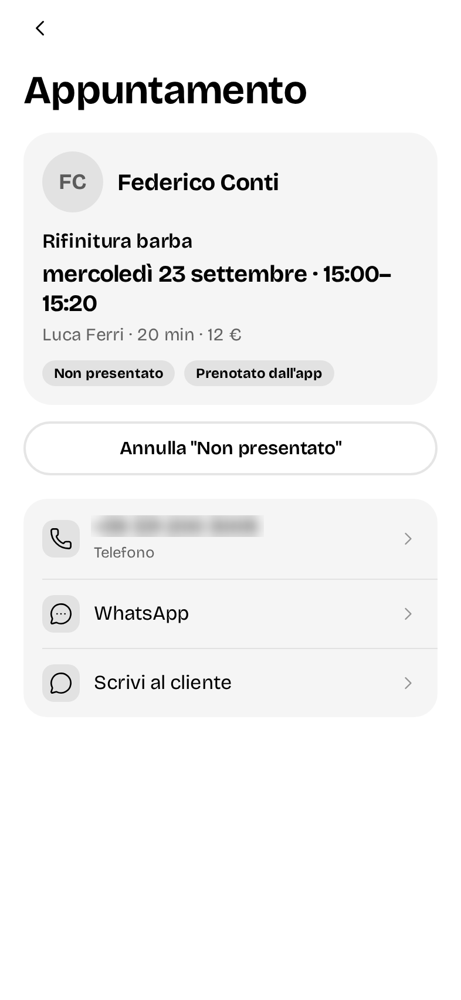
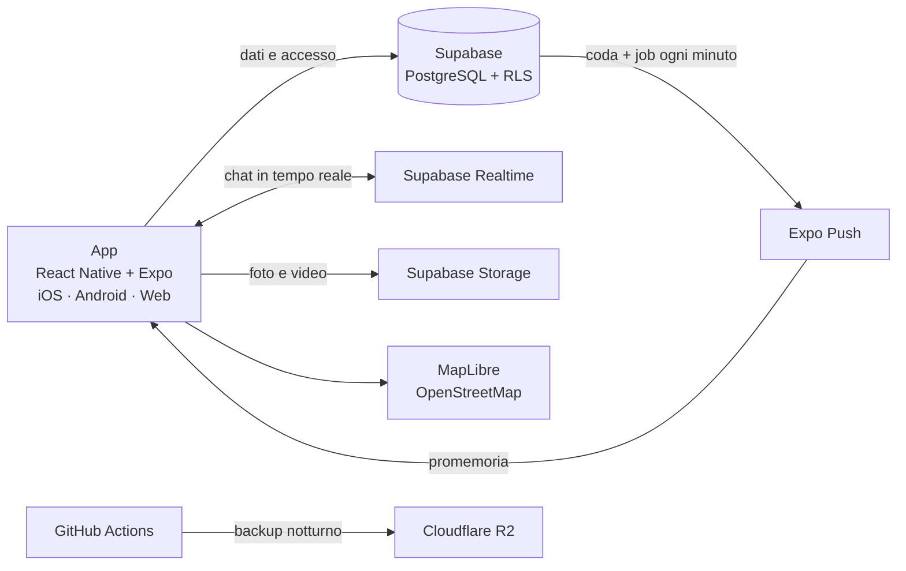
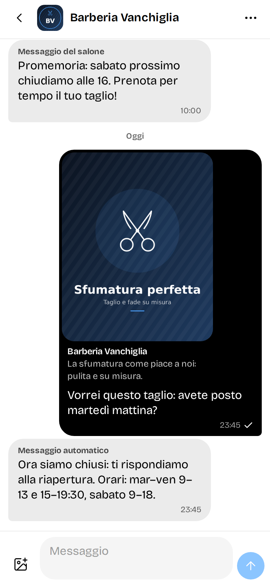

# Salon App · vetrina del progetto

**Italiano** · [English](README.md)

> Questo repository è una **vetrina**: contiene la struttura delle cartelle e le schermate dell'app, non il codice. Il codice è privato perché il prodotto è in uso da un cliente reale.

  

## 1. Cos'è

Un'app per gestire il salone e gli appuntamenti in modo semplice. Mette in contatto titolare e cliente quasi come un social: ci sono le vetrine, dove il salone si pubblicizza esponendo prodotti, lavori e servizi. L'obiettivo è avvicinare il più possibile il cliente al salone.

## 2. Il problema

È pensata per due tipi di persone. I titolari che vogliono gestire il proprio salone in modo organizzato ed efficiente: metriche su ogni sede, dipendenti e turni, clienti. E soprattutto i clienti che cercano il prossimo salone: possono spaziare tra varie categorie e sapere in anticipo a che mani si affidano, perché la vetrina di ogni salone è trasparente sul servizio offerto e sulla qualità.

### Cosa cambia rispetto alle app esistenti

Parlando con il mio parrucchiere, mi ha raccontato tutti i problemi delle app che aveva usato fino a quel momento. Su quelle lamentele ho sviluppato questa applicazione, ma senza fermarmi alle sue: ho pensato anche ai problemi che potrebbero avere gli altri tipi di salone.

- **Contatto diretto:** con altre app il cliente prenota, ma il titolare non ha modo di contattarlo. Qui sì.
- **Personalizzazione senza costi da app su misura:** il titolare adatta vetrina, profilo e logo alle proprie esigenze, senza doversi far costruire un'app esclusiva che alzerebbe tantissimo i costi. Un piccolo compromesso sulla personalizzazione, un grande vantaggio sul prezzo.
- **Il logo del salone sul telefono del cliente:** per prenotare, il cliente si associa a un salone, e nella home del suo telefono l'app mantiene il suo nome ma prende il logo del salone. Per il titolare è come se i suoi clienti avessero un'app personalizzata, senza che ce l'abbiano davvero.
- **Vetrina dei prodotti:** molti titolari vogliono mostrare ai clienti i prodotti in vendita nel salone, che di solito si perdono nella confusione della prenotazione quando ci si presenta lì.
- **Disponibilità chiara:** per ogni salone si vede subito quando c'è posto.

 

## 3. Come funziona

1. Il cliente scarica l'app dagli store ufficiali e si trova subito davanti una carrellata di post e video dei saloni della sua zona, localizzati tramite GPS. Fin da subito si rende conto di quali servizi ha intorno.
2. Cerca quello che gli interessa nella barra in alto, anche per macro categorie, e sceglie sulla mappa interattiva il salone più vicino o quello che più gli piace.

3. Entra nel profilo del salone e vede quanto è apprezzato: recensioni, prodotti, servizi e team.
4. Scelto il salone, preme "Prenota": sceglie il professionista, il servizio e l'orario, e può aggiungere dettagli per richieste particolari che escono dagli standard del salone. Per prenotare serve l'iscrizione.
5. Dopo la prenotazione può aggiungerla al calendario, aprire le indicazioni stradali e scrivere direttamente al salone, per dare o chiedere informazioni.

6. L'app gli ricorda l'appuntamento 24 ore prima e un'ora prima.
7. Superato l'orario, l'appuntamento resta confermato. Se il cliente non si presenta, il titolare o il professionista lo segnano come "Non presentato": esce dall'incasso stimato e finisce nel contatore dei non presentati del cruscotto.

 

## 4. Architettura

Un solo codice per iOS, Android e web, con tutto il backend su Supabase.

- **App:** React Native con Expo e TypeScript. Un solo codice per tre piattaforme, interfaccia in italiano e inglese.
- **Database:** PostgreSQL su Supabase, con Row Level Security su ogni tabella. La logica sta in funzioni SQL che verificano chi le chiama prima di restituire qualsiasi dato. I contatti personali stanno in una tabella separata. 37 migrazioni versionate.
- **Autenticazione:** Supabase Auth con email e password; accesso con Apple e Google già pronto nel codice.
- **Chat:** costruita da zero, senza servizi esterni. Tempo reale con Supabase Realtime, foto in uno spazio privato con link che scadono dopo un'ora, messaggi programmabili.
- **Notifiche:** il database mette in coda le notifiche e un job ogni minuto le invia tramite Expo Push, compresi i promemoria 24 ore e un'ora prima dell'appuntamento.
- **Mappe:** MapLibre con mappe OpenStreetMap e ricerca indirizzi Photon, senza account né chiavi a pagamento. Le indicazioni stradali si aprono in Google Maps o Apple Maps.
- **Storage:** tre spazi separati — media dei saloni e foto profilo pubblici, chat privata.
- **Social:** i post di Instagram, Facebook e TikTok si incorporano nella vetrina tramite gli endpoint pubblici.
- **Backup:** copia notturna del database su Cloudflare R2.

Notifiche push e accesso con Apple e Google sono pronti nel codice e attendono le credenziali di produzione.

## 5. Scelte tecniche

Ho scelto strumenti maturi e molto diffusi, perché sono affidabili e ben documentati. Non avendo l'esperienza per valutare da solo l'affidabilità di una piattaforma, ho dato peso a quelle più adottate e consigliate da chi le usa. Per i costi ho puntato sui piani gratuiti: l'app al momento non ha grandi pretese, e non aveva senso spingersi in abbonamenti o piattaforme professionali oltre il necessario. Sono scelte ponderate: non ho preso quello che capitava, ho selezionato quello che serviva.

## 6. Sicurezza e verifica

La sicurezza per me è fondamentale: punto molto sulla privacy, e i dati di clienti e titolari dovevano essere tutelati fin dall'inizio. Prima di scrivere codice ho chiesto dove sarebbero finiti i dati e come potevano essere esposti. Durante lo sviluppo c'è stata una fase dedicata alla sicurezza:

- **Row Level Security su ogni tabella**, verificata con l'advisor di sicurezza di Supabase.
- **Controlli dentro ogni funzione:** prima di restituire dati, ogni funzione verifica chi la sta chiamando. I controlli stanno in uno schema privato, non raggiungibile dall'esterno.
- **Dati separati per sensibilità:** contatti personali in una tabella a parte, foto della chat in uno spazio privato con link che scadono dopo un'ora.
- **Revisione con test d'attacco:** ha trovato 16 problemi, 15 minori e uno serio — una catena che, partendo dalle recensioni, permetteva di risalire all'identificativo di un account e ai suoi dati personali. Corretto prima del rilascio.
- **Test di autorizzazione automatici** *(in corso)*: per ogni funzione, un utente prova ad accedere ai dati di un altro. Il risultato atteso è sempre il divieto.

## 7. Problemi e soluzioni

- **Il logo personalizzato.** Volevo che ogni cliente vedesse sul telefono il nome e il logo del proprio salone. I sistemi operativi però non permettono di cambiare il nome di un'app, e accettano solo icone già incluse al momento della pubblicazione. La soluzione: il nome resta fisso, e ogni nuovo logo entra nell'app con un aggiornamento, diventando selezionabile.
- **Dare valore ai contenuti dei saloni.** I saloni producono foto e video dei loro lavori, ma serviva un modo perché quel materiale portasse davvero a una prenotazione. La soluzione: ogni post si può inoltrare direttamente in chat al salone, come riferimento o modello del servizio desiderato. Se vedo un taglio che mi piace, lo mando al salone e chiedo quello, senza dover spiegare altro. Il cliente non deve più capire da solo cosa vuole: è il salone che gli propone qualcosa che lo attira, e dal feed alla prenotazione il passo è brevissimo. È l'obiettivo, da verificare con l'uso reale.

 

## 8. Stato

*Aggiornato a ottobre 2026*

- In sviluppo, non ancora pubblicata sugli store.
- Primo cliente pronto all'uso: un salone con due sedi.
- Codice unico per iOS, Android e web; 37 migrazioni del database; circa 80 funzioni con controlli di accesso.
- Prima del lancio: mittente email dedicato, credenziali per le notifiche push, test di autorizzazione automatici.

## 9. Metodo

**"L'hai fatta tu o l'AI?"** Ho progettato, deciso e verificato io. Il codice l'ha scritto l'AI, dentro un processo che controllo in ogni passaggio.

**Tre ruoli**
- **Operatore (io):** do le direttive, eseguo i test dal vivo e coordino le altre due figure, perché lavorino a turno e si correggano a vicenda. Non in automatico: in ogni passaggio devo sapere cosa sta succedendo.
- **DD, Design Director:** un'istanza dedicata alle decisioni. Prende un'idea, la adatta al progetto e la trasforma in istruzioni precise.
- **CC, Claude Code:** lo sviluppatore. Scrive il codice, lo legge e ne verifica i test.

**Il ciclo del progetto.** Scompongo l'app per ambiti — interfaccia, backend, database, sicurezza, funzionalità — e procedo in ordine: scheletro, funzioni e loro fattibilità su iOS e Android, struttura, backend, interfaccia, con test a ogni fase. Vicino alla versione finale: test incrociati su tutte le funzioni e ricerca di vulnerabilità. Poi rifinitura e rilascio.

**Il ciclo di ogni modifica.** Ogni intervento sul codice segue la stessa sequenza:
1. Ragionamento scritto: cosa deve fare la modifica e perché.
2. Ricognizione del codice esistente, per lavorare su com'è scritto davvero.
3. Progettazione della modifica sul codice reale.
4. Test scritti prima del codice, che devono fallire.
5. Implementazione, finché i test passano.
6. Smoke test: prova del flusso reale, prima dall'AI, poi da me a mano.
7. Correzioni, e si riparte dal punto 4.

**La revisione.** Chi scrive non si revisiona: le verifiche importanti passano da istanze diverse. Ogni problema segnalato va collegato a file e riga, e almeno un controllo è affidato a strumenti automatici — test e advisor di sicurezza — non solo a modelli.

## 10. Prossimi passi

- Scegliere il nome definitivo.
- Mittente email dedicato, per le conferme di registrazione.
- Credenziali per le notifiche push (Apple e Android) e token d'accesso per Expo Push.
- Test di autorizzazione automatici e una GitHub Action che lanci i test a ogni modifica.
- Collegamento degli account social del salone.
- Provare il logo personalizzato su un iPhone vero.
- Pubblicazione sugli store.

---

*Le schermate usano dati dimostrativi.*
