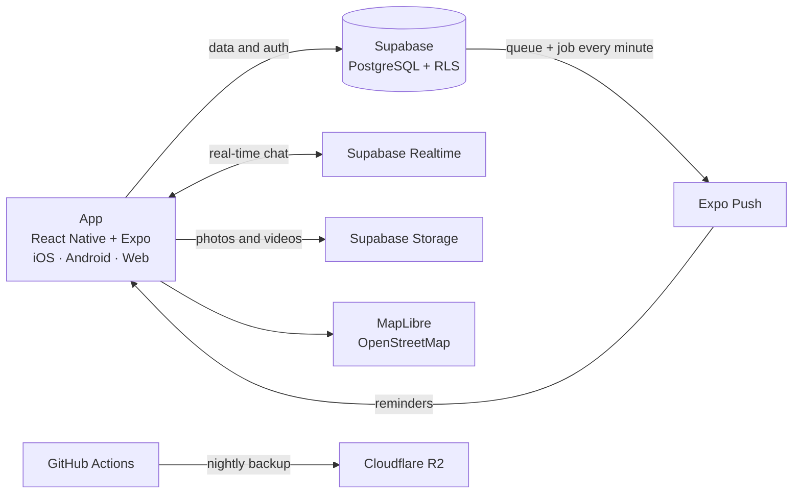

# Salon App · project showcase

[Italiano](README.it.md) · **English**

> This repository is a **showcase**: it contains the folder structure and screenshots of the app, not the code. The code is private because the product is in use by a real client.

  

## 1. What it is

An app for managing a salon and its appointments in a simple way. It connects owners and clients almost like a social network: each salon has a showcase where it promotes its products, work and services. The goal is to bring clients as close as possible to the salon.

## 2. The problem

It is built for two kinds of people. Owners who want to run their salon in an organized, efficient way: metrics for each location, staff and shifts, clients. And above all clients looking for their next salon: they can browse across categories and know in advance whose hands they are putting themselves in, because every salon's showcase is transparent about the service it offers and its quality.

### What is different from existing apps

Talking with my hairdresser, he told me about all the problems with the apps he had used until then. I built this app around those complaints, but without stopping at his: I also thought about the problems other kinds of salons might have.

- **Direct contact:** with other apps the client books, but the owner has no way to reach them. Here they can.
- **Customization without the cost of a custom app:** owners adapt their showcase, profile and logo to their needs, without having an exclusive app built for them, which would drive costs up enormously. A small compromise on customization, a big advantage on price.
- **The salon's logo on the client's phone:** to book, a client joins a salon, and on their phone's home screen the app keeps its name but takes on the salon's logo. For the owner it is as if their clients had a custom app, without them actually having one.
- **Product showcase:** many owners want to show clients the products they sell in the salon, which usually get lost in the confusion of the visit.
- **Clear availability:** for every salon you can immediately see when there is a free slot.

 

## 3. How it works

1. The client downloads the app from the official stores and is immediately shown a stream of posts and videos from salons in their area, located via GPS. Right away they can see which services are around them.
2. They search for what they want in the top bar, also by main category, and pick the nearest salon — or the one they like most — on the interactive map.

3. They open the salon's profile and see how well regarded it is: reviews, products, services and team.
4. Once they have chosen, they tap "Book": they pick the professional, the service and the time, and can add details for special requests outside the salon's standard offer. Booking requires an account.
5. After booking they can add it to their calendar, open directions, and message the salon directly to give or ask for information.

6. The app reminds them of the appointment 24 hours and one hour before.
7. Once the time has passed, the appointment stays confirmed. If the client does not show up, the owner or the professional marks it as "No-show": it is removed from estimated revenue and counted in the dashboard's no-show counter.

 

## 4. Architecture

A single codebase for iOS, Android and web, with the whole backend on Supabase.

- **App:** React Native with Expo and TypeScript. One codebase for three platforms, interface in Italian and English.
- **Database:** PostgreSQL on Supabase, with Row Level Security on every table. The logic lives in SQL functions that check who is calling before returning any data. Personal contact details are kept in a separate table. 37 versioned migrations.
- **Authentication:** Supabase Auth with email and password; Sign in with Apple and Google already in the code.
- **Chat:** built from scratch, no third-party services. Real time via Supabase Realtime, photos in private storage with links that expire after one hour, scheduled messages.
- **Notifications:** the database queues notifications and a job sends them every minute through Expo Push, including the reminders 24 hours and one hour before each appointment.
- **Maps:** MapLibre with OpenStreetMap tiles and Photon address search, no accounts or paid keys. Directions open in Google Maps or Apple Maps.
- **Storage:** three separate buckets — salon media and profile photos public, chat private.
- **Social:** Instagram, Facebook and TikTok posts are embedded in the showcase through their public endpoints.
- **Backup:** nightly copy of the database to Cloudflare R2.

Push notifications and Apple/Google sign-in are ready in the code and waiting for production credentials.

## 5. Technical choices

I chose mature, widely used tools because they are reliable and well documented. Lacking the experience to judge a platform's reliability on my own, I gave weight to the ones most adopted and recommended by the people who use them. On costs I went with free tiers: the app is not demanding at the moment, and it made no sense to go further than necessary with subscriptions or professional platforms. These are deliberate choices: I did not take whatever came along, I selected what was needed.

## 6. Security and verification

Security is fundamental to me: I care a lot about privacy, and client and owner data had to be protected from the start. Before writing any code I asked where the data would end up and how it could be exposed. Development included a dedicated security phase:

- **Row Level Security on every table**, verified with Supabase's security advisor.
- **Checks inside every function:** before returning data, each function verifies who is calling it. The checks live in a private schema that cannot be reached from outside.
- **Data separated by sensitivity:** personal contacts in a separate table, chat photos in private storage with links that expire after one hour.
- **Attack-style review:** it found 16 issues, 15 minor and one serious — a chain that, starting from reviews, made it possible to trace an account's identifier and reach its personal data. Fixed before release.
- **Automated authorization tests** *(in progress)*: for every function, one user tries to access another user's data. The expected result is always denial.

## 7. Problems and solutions

- **The custom logo.** I wanted every client to see their salon's name and logo on their phone. Operating systems, however, do not allow changing an app's name, and only accept icons already included at publication. The solution: the name stays fixed, and each new logo ships with an app update and becomes selectable.
- **Giving value to salons' content.** Salons produce photos and videos of their work, but there had to be a way for that material to actually lead to a booking. The solution: every post can be forwarded directly to the salon in chat, as a reference or template for the desired service. If I see a cut I like, I send it to the salon and ask for that, with no further explanation. Clients no longer have to work out on their own what they want: the salon offers them something that catches their eye, and from feed to booking is a very short step. That is the goal, to be validated with real use.

 

## 8. Status

*Updated October 2026*

- In development, not yet published on the stores.
- First client ready to use it: a salon with two locations.
- One codebase for iOS, Android and web; 37 database migrations; about 80 functions with access checks.
- Before launch: dedicated email sender, push notification credentials, automated authorization tests.

## 9. Method

**"Did you build it, or did the AI?"** I designed, decided and verified. The AI wrote the code, inside a process I control at every step.

**Three roles**
- **Operator (me):** I give the direction, run the live tests and coordinate the other two roles, so they work in turns and correct each other. Not automatically: at every step I need to know what is happening.
- **DD, Design Director:** an instance dedicated to decisions. It takes an idea, adapts it to the project and turns it into precise instructions.
- **CC, Claude Code:** the developer. It writes the code, reads it and verifies its tests.

**The project cycle.** I break the app down by area — interface, backend, database, security, features — and proceed in order: skeleton, features and their feasibility on iOS and Android, structure, backend, interface, with tests at every stage. Close to the final version: cross-testing of all features and a search for vulnerabilities. Then polish and release.

**The cycle of every change.** Every change to the code follows the same sequence:
1. Written reasoning: what the change must do and why.
2. Reconnaissance of the existing code, to work on how it is actually written.
3. Design of the change on the real code.
4. Tests written before the code, which must fail.
5. Implementation, until the tests pass.
6. Smoke test: the real flow is tried, first by the AI, then by me by hand.
7. Fixes, then back to step 4.

**Review.** Whoever writes does not review: important checks go through different instances. Every issue raised must be tied to a file and line, and at least one check is left to automated tools — tests and the security advisor — not only to models.

## 10. Next steps

- Choose the final name.
- Dedicated email sender for sign-up confirmations.
- Push notification credentials (Apple and Android) and an access token for Expo Push.
- Automated authorization tests and a GitHub Action that runs the tests on every change.
- Linking the salon's social accounts.
- Test the custom logo on a real iPhone.
- Store release.

---

*Screenshots use demo data.*
